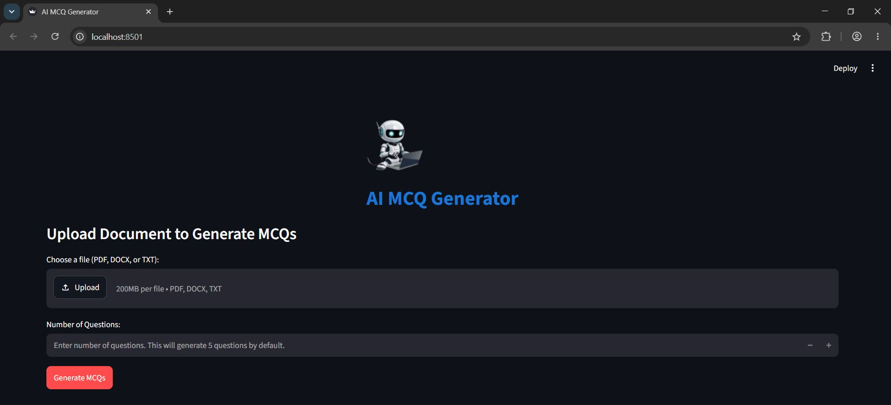
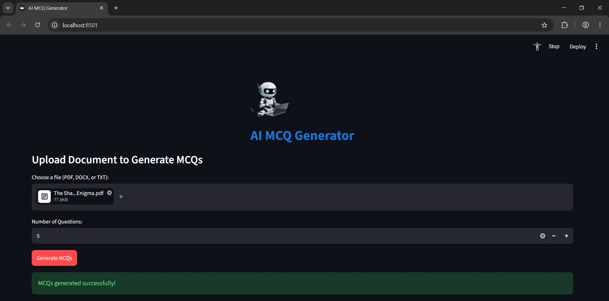
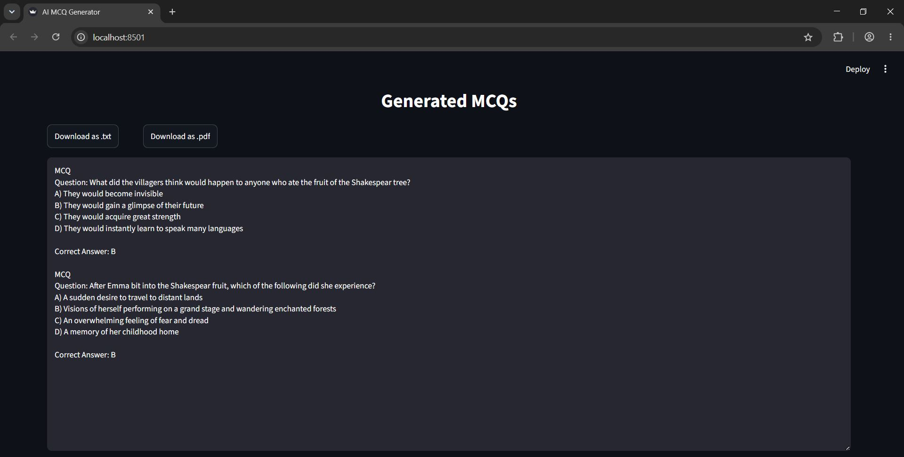

# 🤖 AI MCQ Generator

A **document-based AI multiple-choice question generator** built using Python, LangChain, Groq, and Streamlit. The application allows users to upload a PDF, DOCX, or TXT file and automatically generates multiple-choice questions from the content of the uploaded document.

The generated questions contain four answer options, with one correct answer, and can be downloaded as `.txt` or `.pdf` files.

<p align="center">  </p>
&nbsp;&nbsp;&nbsp;
<p align="center">  </p>
&nbsp;&nbsp;&nbsp;
<p align="center">  </p>

## About the Project

The **AI MCQ Generator** is designed to make it easier to create quiz and exam questions from existing educational or informational content.

Users can upload a document containing text, select the number of questions they want to generate, and let the AI generate MCQs based only on the information provided in the uploaded document.

The application supports:

* PDF files
* DOCX files
* TXT files
* Custom number of questions
* AI-generated multiple-choice questions
* Four options per question
* One correct answer per question
* TXT download
* PDF download

The application uses **Groq's LLM API** through **LangChain** to generate the questions.

## How It Works

The application follows these main steps:

### 1. Upload a Document

Users can upload a document in one of the supported formats:
* `.pdf`
* `.docx`
* `.txt`

The Streamlit file uploader handles the uploaded file.

### 2. Extract Text

The application extracts text from the uploaded document depending on its file type.

* For PDF files, the project uses **pdfplumber**:
* For DOCX files, the project uses **python-docx**:
* For TXT files, the application reads the file using UTF-8 encoding:

### 3. Generate MCQs

The extracted text is passed to a LangChain prompt and an LLM provided through Groq.

[Create Groq API Key](https://console.groq.com/home)

The model is instructed to generate the requested number of multiple-choice questions using only the information contained in the uploaded document.

### 4. Apply Question Requirements

The prompt provides several rules for the generated questions.

Each question must:
* Be directly related to the provided content
* Avoid outside information
* Have exactly four options
* Contain options A, B, C, and D
* Have only one correct answer
* Have plausible incorrect options
* Avoid repeated questions
* Clearly indicate the correct answer
* Avoid unnecessary explanations
* Avoid referring to phrases such as "According to the text..."
* Avoid copying complete sentences directly from the document

The generated format is:

```text
MCQ
Question: [Question]

A) [Option A]
B) [Option B]
C) [Option C]
D) [Option D]

Correct Answer: [A, B, C or D]
```

### 5. Display Generated Questions

The generated questions are then displayed inside the Streamlit application.

### 6. Download the Questions

Users can download the generated questions in two formats:

* `.txt`
* `.pdf`

The TXT file contains the generated MCQs as plain text.
The PDF version is generated using **FPDF** and the **DejaVu Sans** font.

## AI Model

The project uses **Groq** to access the language model through LangChain.

The current model configuration is:

```python
model="openai/gpt-oss-120b"
```

The temperature is set to:

```python
temperature=0.0
```

A low temperature helps make the generated output more consistent and predictable.

## Technologies Used

* **Python** – Core programming language
* **Streamlit** – Web application interface
* **LangChain** – Prompt management and LLM integration
* **Groq** – LLM API provider
* **pdfplumber** – PDF text extraction
* **python-docx** – DOCX text extraction
* **FPDF** – PDF generation
* **python-dotenv** – Environment variable management


### `main.py`

Contains the main application logic, including:

* LLM configuration
* Prompt template
* Text extraction
* MCQ generation
* TXT saving
* PDF generation

### `app.py`

Contains the Streamlit user interface, including:

* File upload
* Question count selection
* Generate button
* Generated question display
* TXT download
* PDF download

## Project Workflow

```text
Upload PDF / DOCX / TXT
          ↓
Save File Temporarily
          ↓
Extract Text
          ↓
Validate Extracted Text
          ↓
Select Number of Questions
          ↓
Send Text to LLM
          ↓
Generate MCQs
          ↓
Store Results in Session State
          ↓
Display Generated Questions
          ↓
       ┌──┴──┐
       ↓     ↓
   TXT File  PDF File
```

## Project Goal

The goal of this project is to build a simple and practical **AI-powered educational tool** that can automatically transform existing documents into multiple-choice quizzes.

By combining **document text extraction**, **large language models**, **LangChain**, **Groq**, and **Streamlit**, the project demonstrates how AI can be used to automate the creation of educational assessment material.
